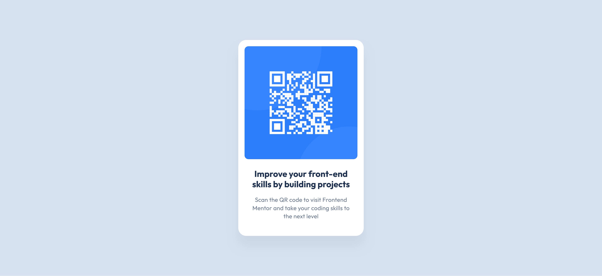

# Frontend Mentor - QR Code Challenge

## Table of contents

- [Overview](#overview)
  - [The challenge](#the-challenge)
  - [Screenshot](#screenshot)
  - [Live preview](#live-preview)
  - [Solution retrospective](#solution-retrospective)

## Overview

### The challenge

The challenge was to build out a QR code component and get it looking as close to the original design as possible (based on a Figma design file).

### Screenshot

### Live preview

- Live Site URL: [Live preview](https://marioncts.github.io/QRCode-Project/)

### Solution retrospective

This is my first challenge on Frontend Mentor. I have basic knowledge of HTML and CSS fundamentals from a previous Web Design training, and I want to improve significantly.

For this challenge, I aimed to get as close as possible to a pixel-perfect solution while ensuring semantic HTML. The Figma design was extremely helpful, and I believe my solution is quite close to the original design.

I wasn't sure if my HTML was correct, so I had to revisit my lessons to ensure I was using the right elements. Since this is such a small page, I initially skipped writing a CSS reset, although I was reminded that it is a good practice, even for small projects.

I corrected this, and with a few minor updates, the page looked even better. This made me realize that, regardless of the project size, writing clean and well-structured code is never 'too much'.

I would be grateful for any kind of feedback!

